# Reporte de calidad transcriptoma *Penaeus monodon*

## Comparación de número de lecturas entre datos crudos y limpiezas

La prueba 1 con *Trimmomatic* incluyó los siguientes parámetros:

1. Remoción de adaptadores y N's
2. Calidad por ventanas de 6 bases de longitud y Q > 20

La prueba 2 con *Trimmomatic* incluyó los siguientes parámetros:

1. Remoción de adaptadores y N's
2. Calidad promedio de todo la lectura Q > 20

No se ve que existan diferencias entre los dos tratamientos con *Trimmomatic*.

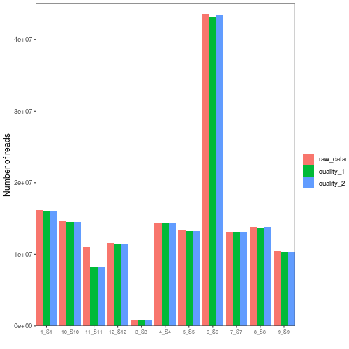

Como se puede ver más adelante, con los dos tratamientos de calidad se mejora la calidad por base a lo largo de todas las lecturas, sin embargo no se pudo mejorar la distribución de nucleótidos al inicio y al final de las lecturas (primeras 14 bases y últimas dos bases). 

## *fastqc* de los datos crudos
Ejemplo con la muestra 1_S1:

#### Calidad por base, R1 (izquierda) y R2 (derecha):
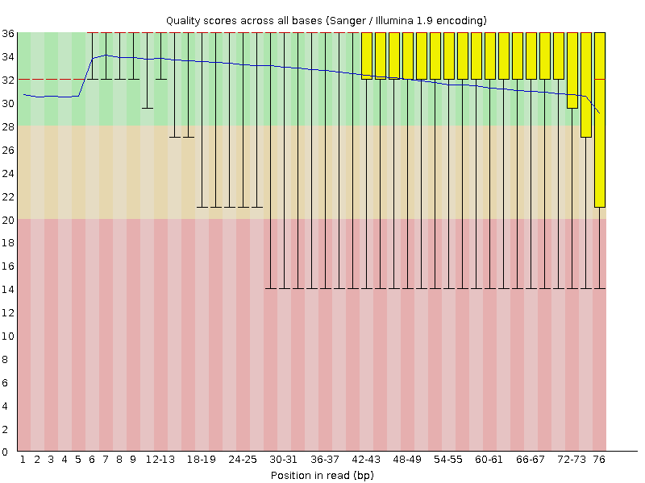

#### Distribución de nucleótidos, R1 (izquierda) y R2 (derecha):
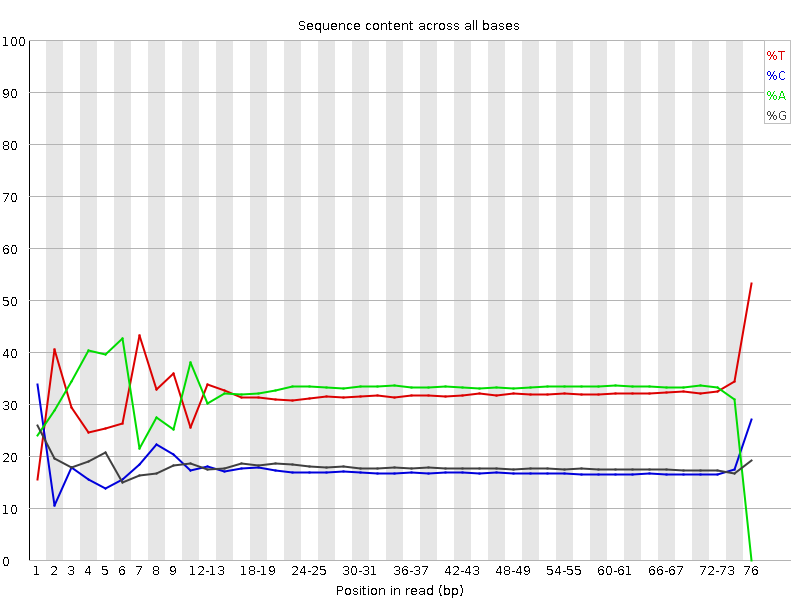

#### Longitud de lecturas, R1 (izquierda) y R2 (derecha):
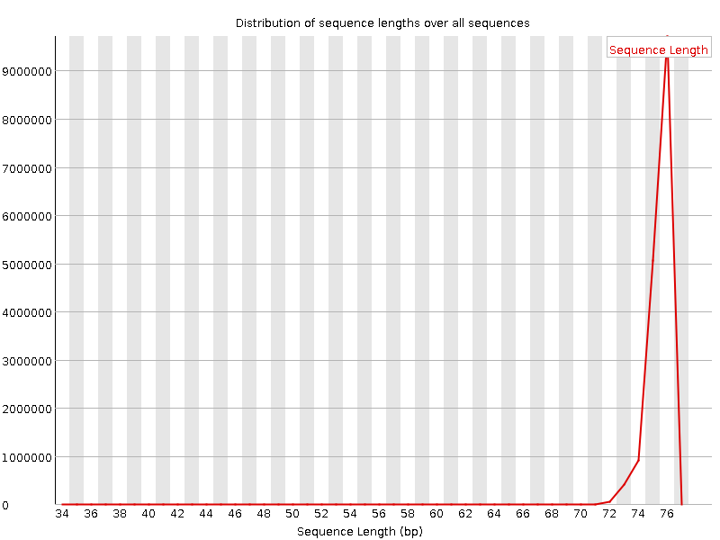

## Prueba 1 de limpieza con *Trimmomatic*

La prueba incluía lo siguientes parámetros:
1. Remoción de adaptadores y N's
2. Calidad por ventanas de 6 bases de longitud y Q > 20

Ejemplo con la muestra 1_S1:

#### Calidad por base, R1 (izquierda) y R2 (derecha)
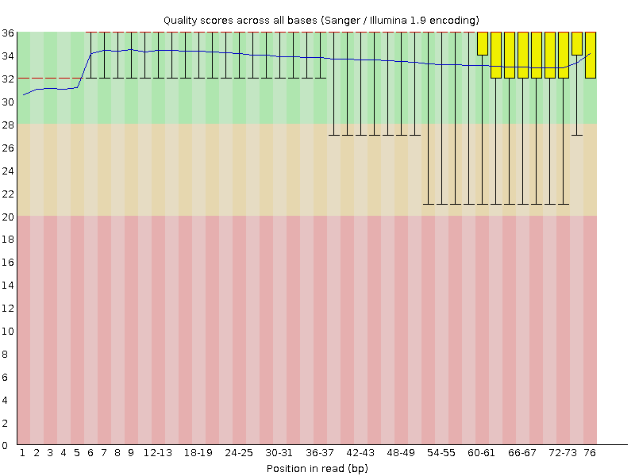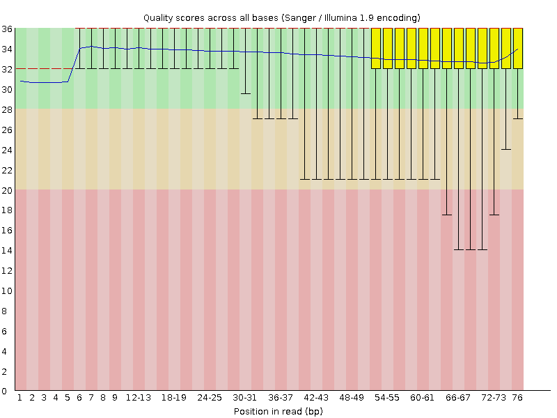

#### Distribución de nucleótidos, R1 (izquierda) y R2 (derecha):
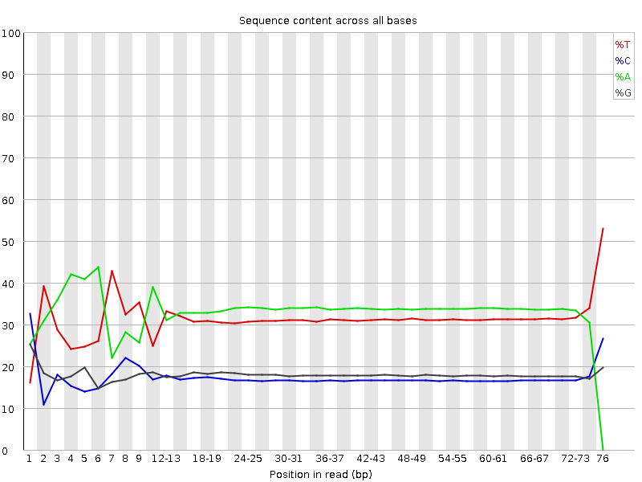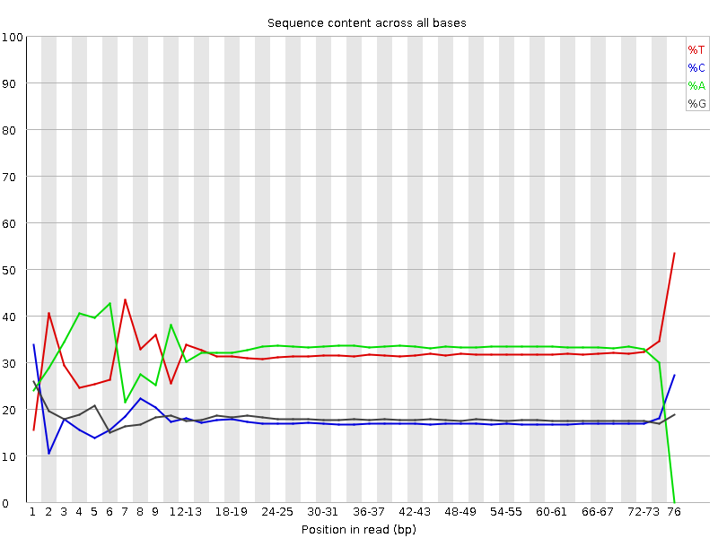

#### Longitud de lecturas, R1 (izquierda) y R2 (derecha):
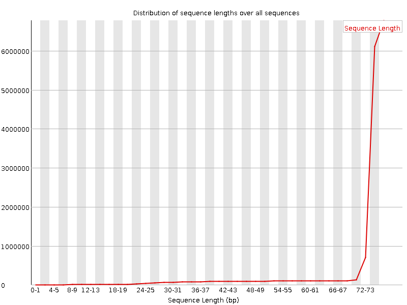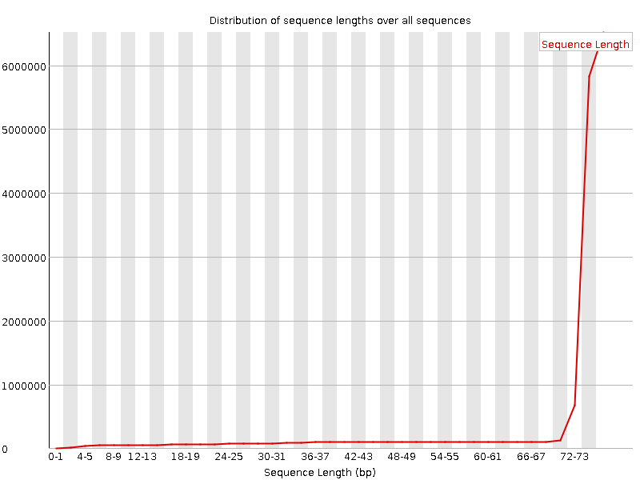

## Prueba 2 de limpieza con *Trimmomatic*

La prueba incluía lo siguientes parámetros:
1. Remoción de adaptadores y N's
2. Calidad promedio Q > 20

Ejemplo con la muestra 1_S1:

#### Calidad por base, R1 (izquierda) y R2 (derecha):
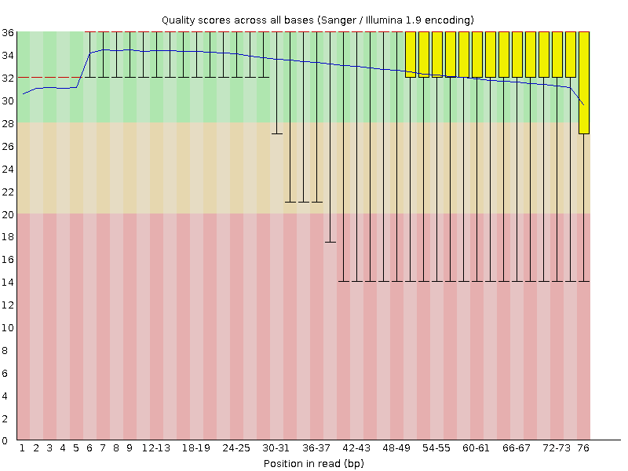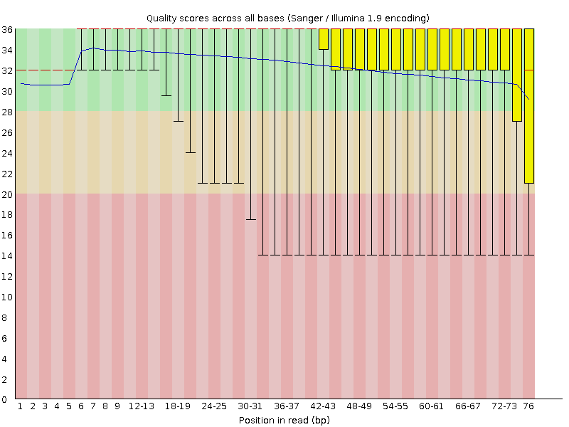

#### Distribución de nucleótidos, R1 (izquierda) y R2 (derecha):
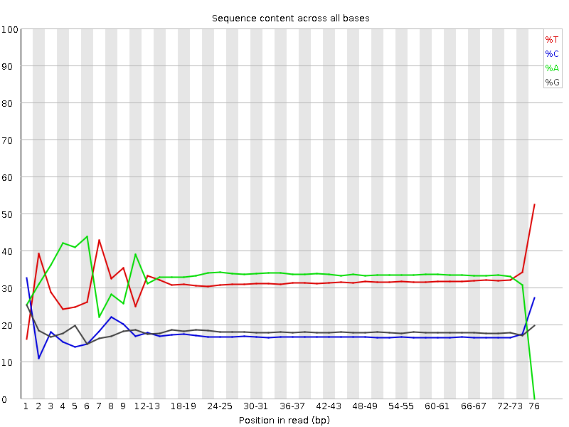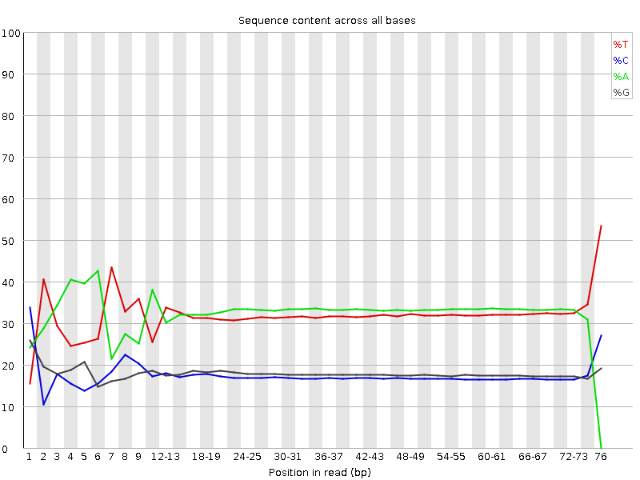

#### Longitud de lecturas, R1 (izquierda) y R2 (derecha):
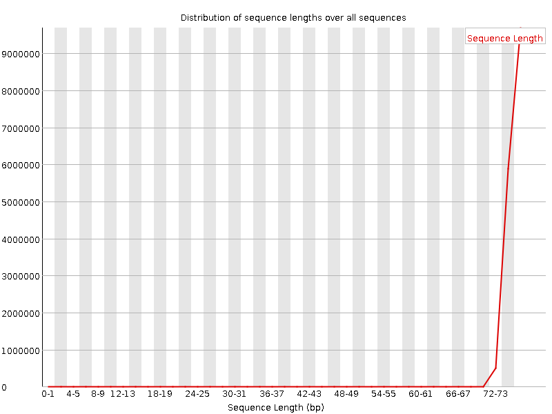

