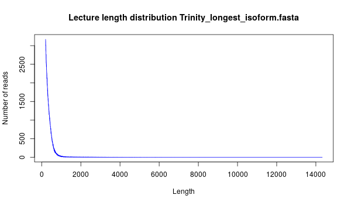
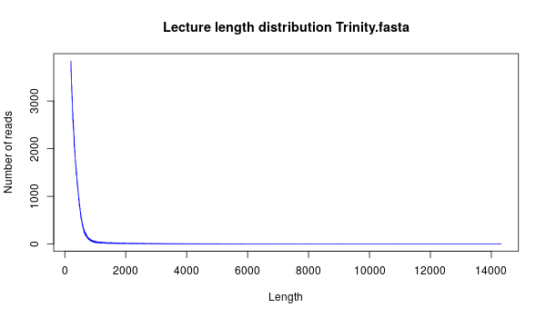
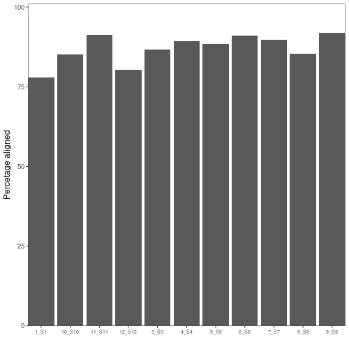

# Reporte de ensamblado de transcriptoma *Penaeus monodon*

## Filtrado de calidad

Antes de hacer el ensamblado se filtraron las lecturas con *Trimmomatic* con los siguientes parámetros:
1. Remoción de adaptadores y N's
2. Calidad promedio de todo la lectura Q > 20

## Ensamblado con *Trinity*

Con los reads limpios se procedío a hacer el ensamblado con *Triniy* considerando todas las muestras juntas y los parámetros default. El *metadata* utilizado para el ensamblado fue el siguiente:

|Muestra|R2|R1|
|-|-|-|-|
|3_S3|3_S3_paired_R1_1.fastq.gz|3_S3_paired_R2_1.fastq.gz|
|4_S4|4_S4_paired_R1_1.fastq.gz|4_S4_paired_R2_1.fastq.gz|
|5_S5|5_S5_paired_R1_1.fastq.gz|5_S5_paired_R2_1.fastq.gz|
|6_S6|6_S6_paired_R1_1.fastq.gz|6_S6_paired_R2_1.fastq.gz|
|7_S7|7_S7_paired_R1_1.fastq.gz|7_S7_paired_R2_1.fastq.gz|
|8_S8|8_S8_paired_R1_1.fastq.gz|8_S8_paired_R2_1.fastq.gz|
|9_S9|9_S9_paired_R1_1.fastq.gz|9_S9_paired_R2_1.fastq.gz|
|10_S10|10_S10_paired_R1_1.fastq.gz|10_S10_paired_R2_1.fastq.gz|
|11_S11|11_S11_paired_R1_1.fastq.gz|11_S11_paired_R2_1.fastq.gz|
|12_S12|12_S12_paired_R1_1.fastq.gz|12_S12_paired_R2_1.fastq.gz|

### Estadísticas de *Trinity*

||Conteo|
|-|-|
|Total trinity 'genes'|557 928|
|Total trinity transcripts|713 269|
|Percent GC|37.68|

#### Estadísticas basadas las isoformas más largas por gen (*Total trinity 'genes'*)

|Parámetro|Valor|
|-|-|
|Contig N10|1 767|
|Contig N20|728|
|Contig N30|559|
|Contig N40|475|
|Contig N50|415|
|Median contig length|323|
|Average contig|408.01|
|Total assembled bases|227 641 327|

##### Distribución de longitud de *Total trinity "genes"*

#### Estadísticas basadas en todas las isoformas por gen (*Total trinity transcripts*)

|Parámetro|Valor|
|-|-|
|Contig N10|3 352|
|Contig N20|1 776|
|Contig N30|826|
|Contig N40|577|
|Contig N50|473|
|Median contig length|331|
|Average contig|470.41|
|Total assembled bases|335 528 861|

##### Distribución de longitud de *Total trinity "transcripts"*

#### Realineamiento por muestra

Para determinar la representatividad de las muestras en el armado, se realinearon con *bowtie2* contra el transcriptoma generado con todas las isoformas (*Trinity.fasta*). Los resultados se pueden observar en las siguientes tabla y figura.

|Muestra|Porcentaje realineaedo|
|-|-|
|1_S1|77.85|
|3_S3|86.66|
|4_S4|89.25|
|5_S5|88.47|
|6_S6|91.07|
|7_S7|89.64|
|8_S8|85.27|
|9_S9|91.94|
|10_S10|85.19|
|11_S11|91.29|
|12_S12|80.36|

